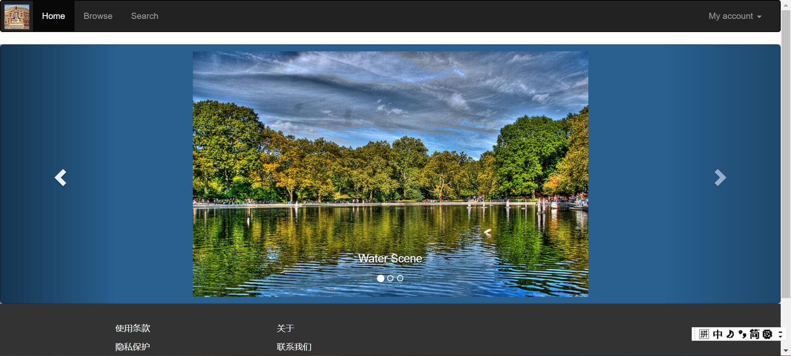

LAB 4 设计文档
==========

## 本次lab效果截图示意


-------------------

### 文件结构
`root` 即直接打开仓库所见的层，或写作 `/lab4`。

```
/lab4
	/index.html
	/index.css
	/images
           /1.jdp
           /2.jdp
           /3.jdp
           /sample.jdp
	/bootstrap-3.3.7-dist
	/lab4文档.md
	/lab4设计文档.md
```
-------------------

## 整体布局

·最上方有一个**导航栏** ， **导航栏**左侧的内容为**Home**(持续高亮) **Browse**和**Search**
右侧的**My account**可下拉

·主页为三张滚动的图片（图片居中 带有介绍的文字）

·最后是页脚部分

-----------------

