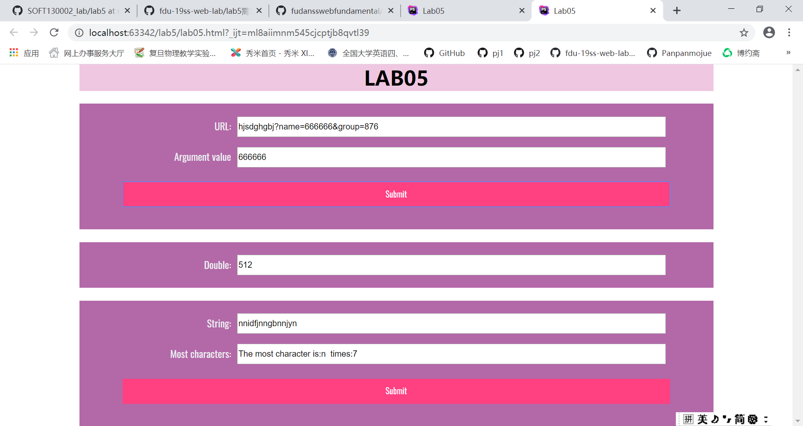

# Lab5设计文档

姓名：夏梦洁
学号：19302010081
## Part1

在showWindowHref函数里面用了spilt()函数，用来以"?"和"%"来拆分url的字符串 
再获取其中的每一个参数，如果有name出现就return name后面的数值； 
如果没有name出现就输出“没有名为name”的参数

## Part2

timeTest函数用于进行翻倍； 
计时器window.setInterval(timeTest,5000)使其每5秒执行一次加倍函数 
stop函数用来停止翻倍，条件是该数值达到了1024或者时间为整点,并用另一个计时器每秒来检测是否达到了停止的条件 
（为了获取时间一开始用的是 new Date ().getMillionSeconds 是否为零，后来不知道为何有问题就改成了秒数能够被60整除）

## Part3

用一个二层循环来依次判断每个字符出现的次数，并根据字符所在的位置次序依次形成一个数组 
依次比较，找出数组中最大的元素的位置。charList[位置数]即是出现最多次数的字符,times[位置数]则是其次数 
最后完成输出

## 效果图
